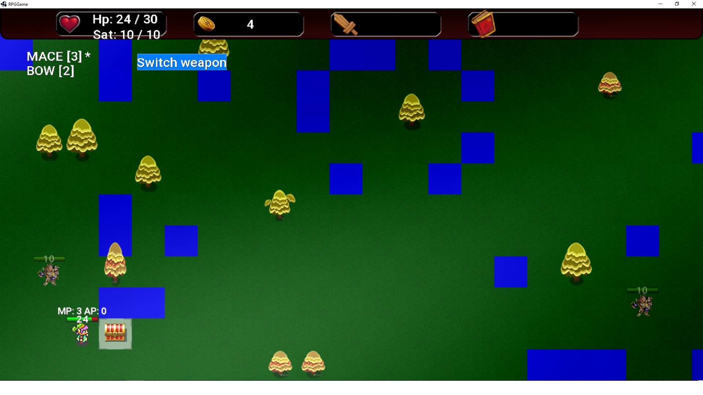
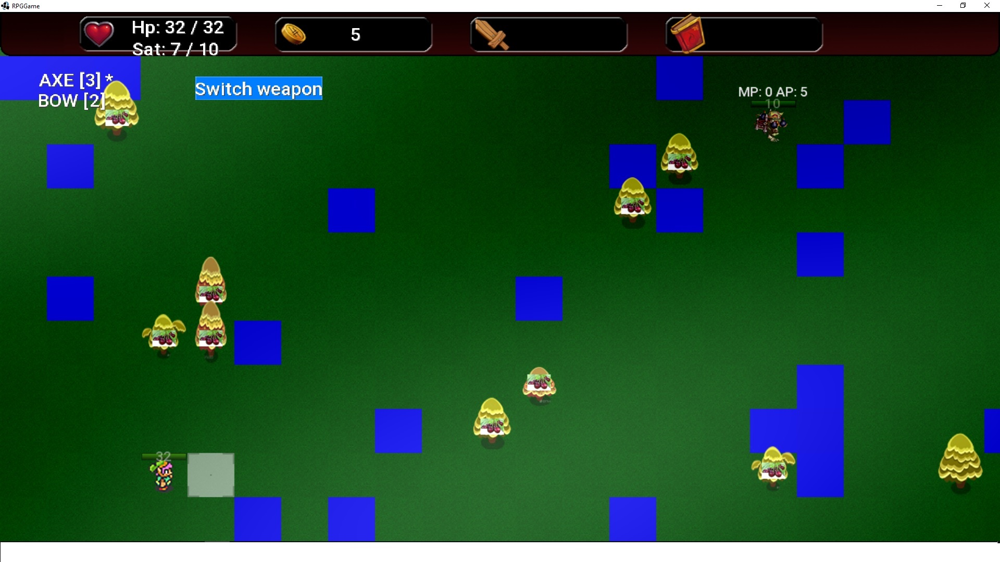

#Проект: РПГ-игра, созданная с использованием LibGDX.
___
##Функционал:
___
* Управление:
  - клавиша "пробел" - завершение хода;
  - левая/правая кнопка мыши (клик) - перемещение/атака;
  - правая кнопка мыши (зажатая) - обзор игрового поля.
* Существует возможность развернуть "окно" игры до разрешения экрана монитора.
* На игровом поле генерируются разные участки местности (трава, вода, деревья).
* Предусмотрено автоматическое завершение хода в случае если 
  у героя отсутствуют очки передвижения и атаки.
* Реализованы анимации передвижения и атаки героя, а также мостров.
* Предусмотрено получение опыта и сбор добычи героем с убитых монстров.
  
* Реализована возможность переключения оружия (левый клик по кпопке "Switch weapon").
* Предусмотрена возможность контратаки, как героя, так и монстров.
* Реализована возможность повышения уровня героя.   
* Предусмотрена возможность сбора ягод для восстановления показателя
  сытости героя.
  